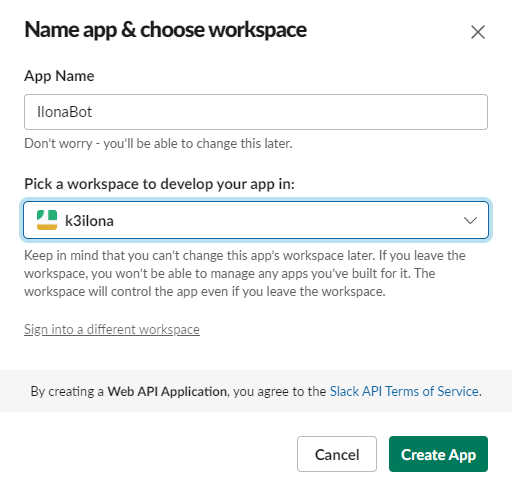
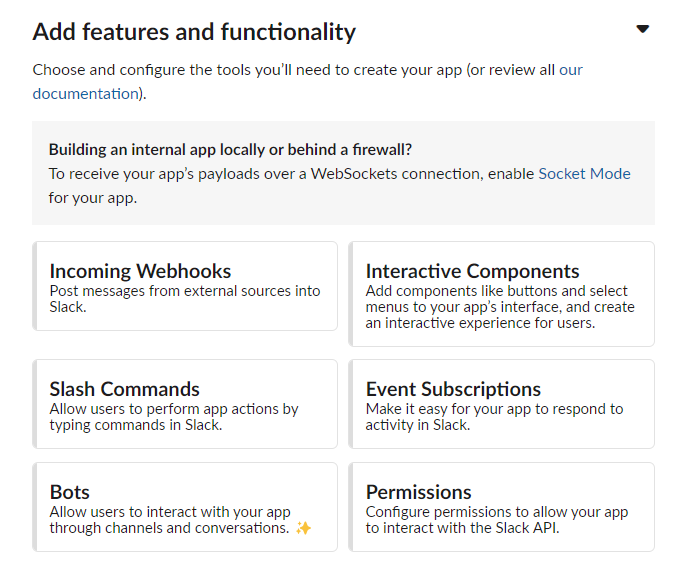
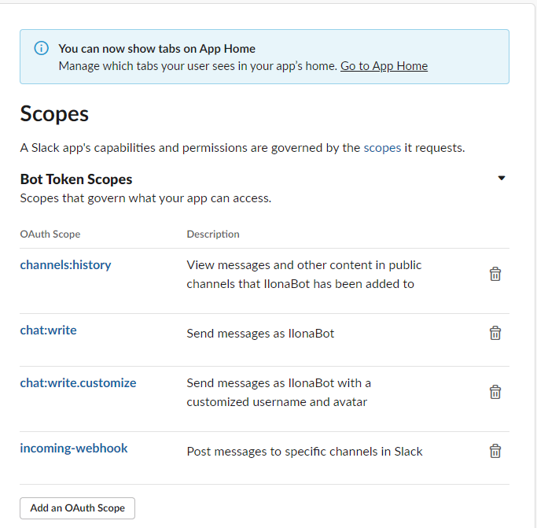
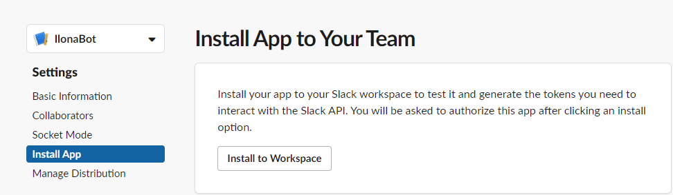
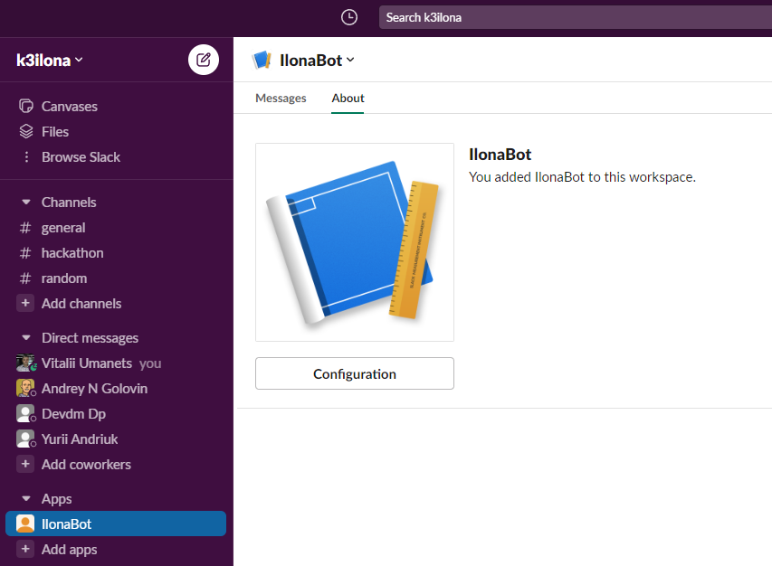

# slack-bot

[How to Develop SlackBot Using Golang?](https://www.technource.com/blog/how-to-create-a-slackbot-using-golang/#What_Is_Slack_Bot)

1. Create a Slack Application

- Go to the Slack website
- Choose “From Scratch”
- Application name from the Slackbot suggestions

  

- Now create a bot with the app



- Click on “Bots”. You will be redirected to the help page
- Add scopes and add permissions to the application
- Click on “Review Scopes to Add”
- Add four main scopes



- Now you can install the application


- Now select a channel that can a bot use. A bot uses a channel to post on an app.


- Click on “Allow”. This way, you can get the OAth Token and Webhook URL important for the authentication.


- Now you have to invite the app to a channel. You can use Slack-bot-Golang



- Write a command message that starts with a Slash /.;Invitethebotwiththecommand/invite@nameofyourbo


2. Golang Setup and Installation

```sh
✗ go mod init IlonaBot
go: creating new go.mod: module IlonaBot

✗ go get -u github.com/slack-go/slack
go: downloading github.com/slack-go/slack v0.12.3
go: downloading github.com/gorilla/websocket v1.4.2
go: downloading github.com/gorilla/websocket v1.5.1
go: added github.com/gorilla/websocket v1.5.1
go: added github.com/slack-go/slack v0.12.3
go: added golang.org/x/net v0.20.0

✗ go get -u github.com/joho/godotenv 
go: downloading github.com/joho/godotenv v1.5.1
go: added github.com/joho/godotenv v1.5.1


```
You have to run the below command for the functioning of the program

```sh
✗ go get
go: downloading github.com/google/go-github v17.0.0+incompatible
go: downloading golang.org/x/oauth2 v0.16.0
go: downloading github.com/google/go-github/v38 v38.1.0
go: downloading google.golang.org/appengine v1.6.7
go: downloading github.com/google/go-querystring v1.0.0
go: downloading golang.org/x/crypto v0.18.0
go: downloading google.golang.org/protobuf v1.31.0
go: added github.com/golang/protobuf v1.5.3
go: added github.com/google/go-github/v38 v38.1.0
go: added github.com/google/go-querystring v1.0.0
go: added golang.org/x/oauth2 v0.16.0
go: added google.golang.org/appengine v1.6.7
go: added google.golang.org/protobuf v1.31.0

✗ go run main.go

```

