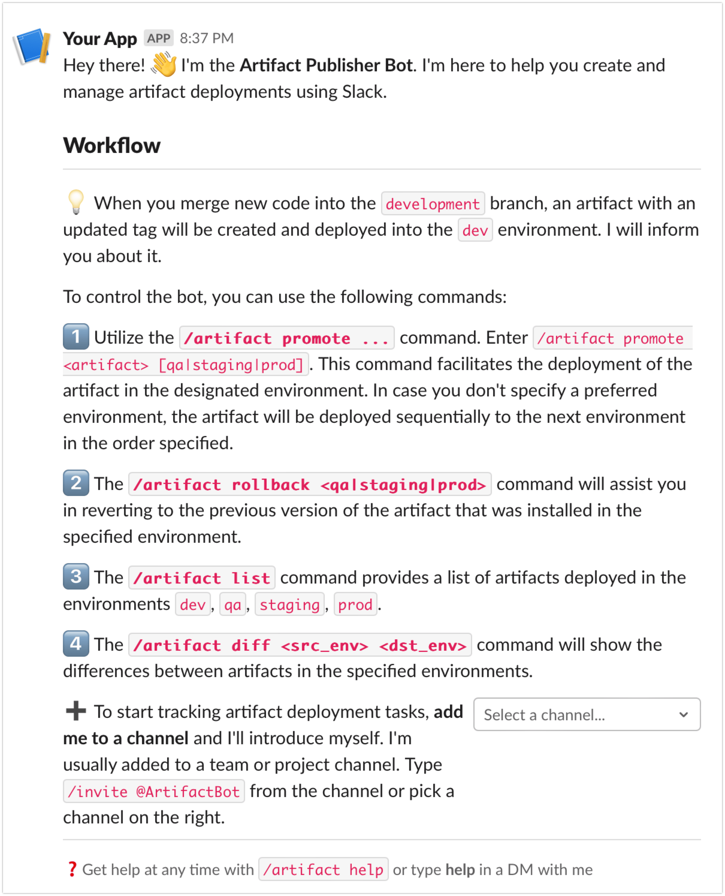
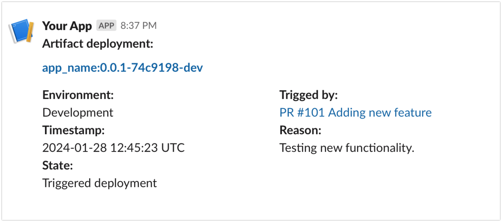
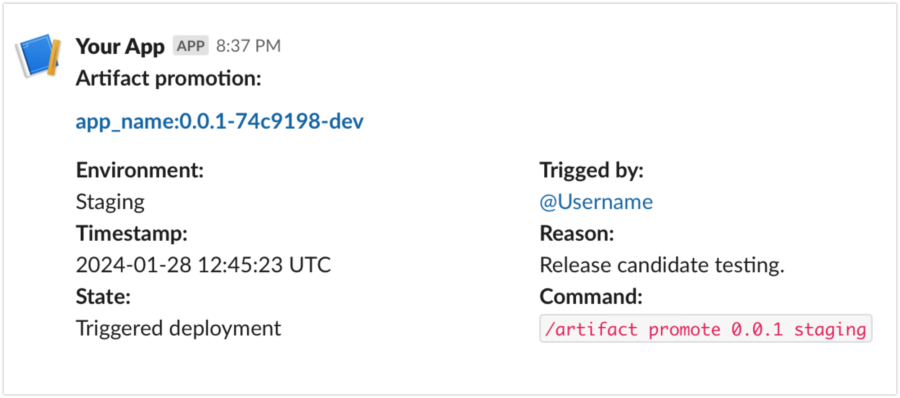
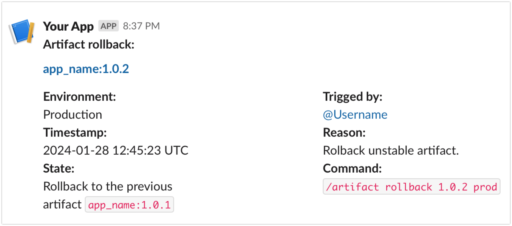
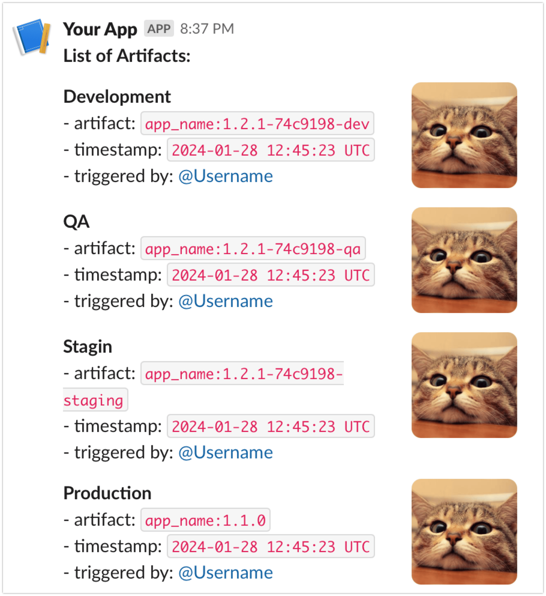

# Користування ботом в Slack для розгортання артефактів у Kubernetes кластері

Бот Slack призначений для полегшення процесу розгортання артефактів застосунків у Kubernetes кластері. Бот дозволяє виконувати наступні дії:

- Перегляд інформації про стан розгорнутих артефактів у кластері
- Розгортання артефактів у кластері
- Повернення артефактів до попередньої версії
- Порівняння версій артефактів

## Користування ботом

Ініціалізуйте бота командою `/invite @BotName` у каналі, в якому ви хочете ним користуватись.

Бот надасть інструкцію щодо користування командами.

Для отримання інформації від бота використовуйте команду `/artifact`.

Розгортання артефактів у кластері в оточені `dev` відбувається автоматично після внесення змін до гілки `dev` у репозиторії розробки

Про розгортання артефакту у кластері бот сповіщає наступним повідомленням:

Повідомлення містить інформацію про артефакт, який було розгорнуто, оточення, час розгортання, подію, яка спричинила розгортання.

Для подальшого розгортання артефакту в іншому оточенні використовуйте команду `/artifact promote <artifact> [environment]`.

Повідомлення міститиме назву артефакту який було задіяно, оточення, в яке було розгорнуто артефакт, час розгортання, особу, яка запросила розгортання та застосовану команду.

Для повернення артефакту до попередньої версії використовується команда `/artifact rollback <artifact> [environment]`.

Для отримання переліку артефактів, які були розгорнуті у кластері використовується команда `/artifact list`.

Отримання інформації про відмінності між версіями артефакту в різних оточеннях відбувається за допомогою команди `/artifact diff <src_env> <dst_env>`.

## Додаткова документація

- [Вибір концепції проєкту](docs/concept.md)  
- [Загальна архітектура системи, основні компоненти, взаємодія між ними та основні функціональні можливості (HLD)](docs/HLD.md)  
- [Розгортання кластера та налаштування контролера Flux2](docs/cluster_deployment.md)
- [Налаштування Secrets у Flux за допомогою Sealed Secrets](docs/sealed-secrets.md)  
- [Створення артефакту IlonaBot, отримання ключів API, початок роботи](docs/Slack_bot.md)