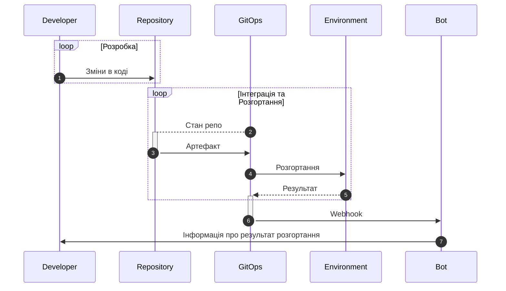

# High Level Design

## Розгортання змін в оточені development

```mermaid
sequenceDiagram
autonumber
    participant D as Developer
    participant R as Repository
    participant G as GitOps
    participant E as Environment
    participant B as Bot

    loop Розробка
        D ->> R: Зміни в коді
    end
    loop Інтеграція та Розгортання
        G -->+ R: Cтан репо
        R ->>- G: Артефакт
        G ->> E: Розгортання
        E -->>+ G: Результат
    end

    G ->>- B: Webhook

    B ->> D: Інформація про результат розгортання
```
