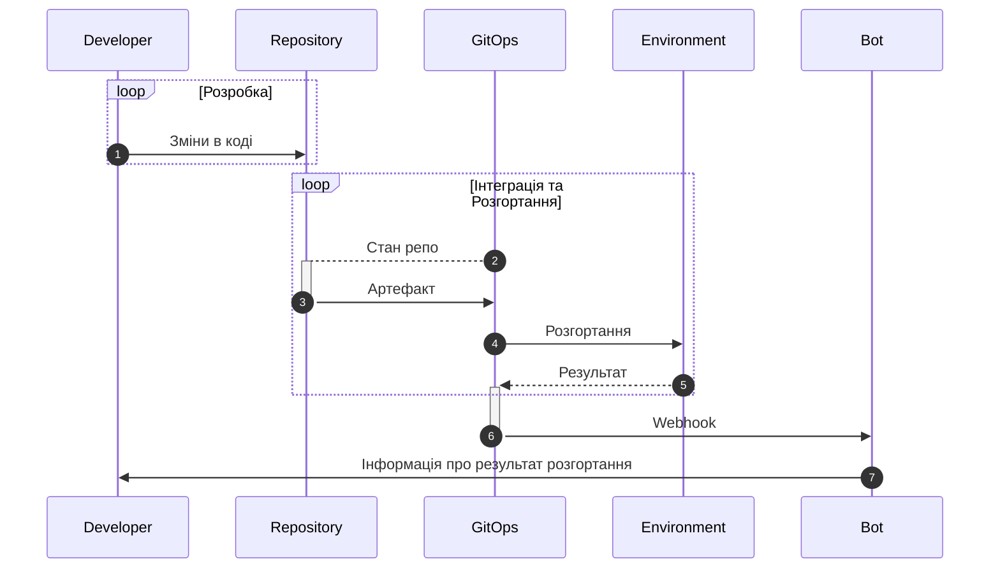
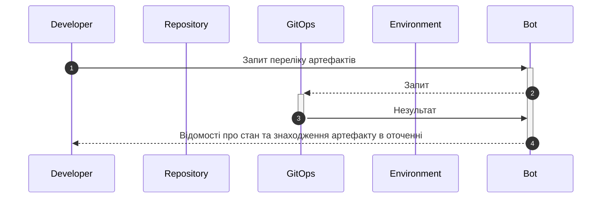
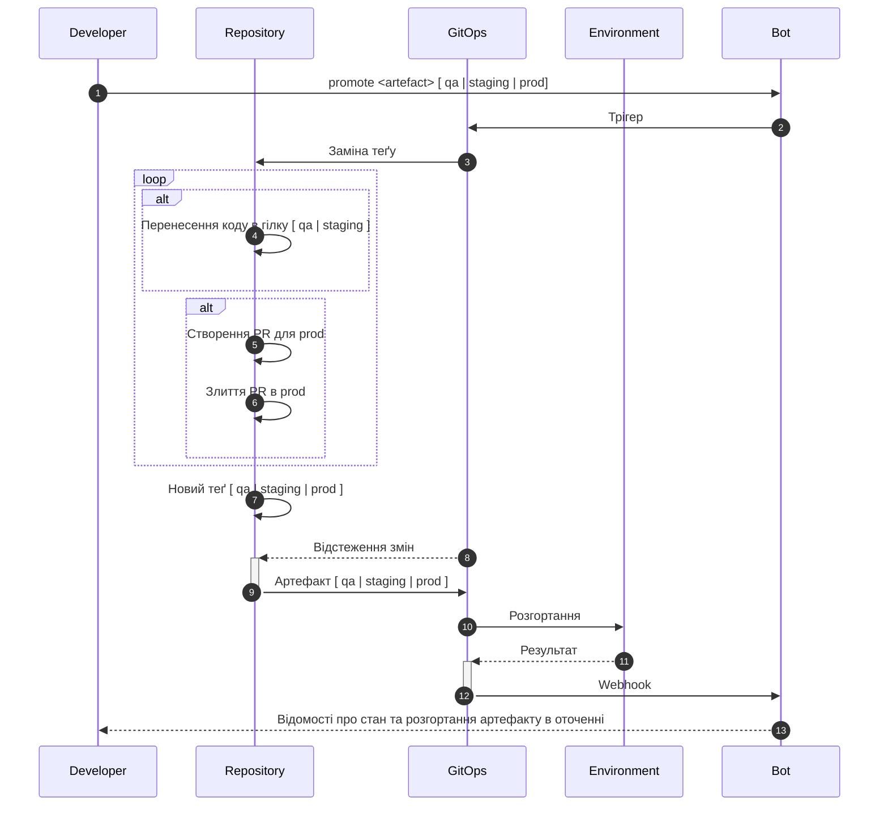

# High Level Design

## Розгортання змін в оточені development

```mermaid
sequenceDiagram
autonumber
    participant D as Developer
    participant R as Repository
    participant G as GitOps
    participant E as Environment
    participant B as Bot

    loop Розробка
        D ->> R: Зміни в коді
    end
    loop Інтеграція та Розгортання
        G -->+ R: Cтан репо
        R ->>- G: Артефакт
        G ->> E: Розгортання
        E -->>+ G: Результат
    end

    G ->>- B: Webhook

    B ->> D: Інформація про результат розгортання
```

## Команда list

```mermaid
sequenceDiagram
autonumber
    participant D as Developer
    participant R as Repository
    participant G as GitOps
    participant E as Environment
    participant B as Bot

    D ->>+ B: Запит переліку артефактів
    B -->>+ G: Запит
    G ->>- B: Hезультат
    B -->>- D: Відомості про стан та знаходження артефакту в оточенні
```

## Команда promote

```mermaid
sequenceDiagram
autonumber
    participant D as Developer
    participant R as Repository
    participant G as GitOps
    participant E as Environment
    participant B as Bot

    D ->> B: promote <artefact> [ qa | staging | prod]
    B ->> G: Трігер
    G ->> R: Заміна теґу
    loop
        alt
            R ->> R: Перенесення коду в гілку [ qa | staging ]
        end
        alt
            R ->> R: Створення PR для prod
            R ->> R: Злиття PR в prod
        end
    end 
    R ->> R: Новий теґ [ qa | staging | prod ]
    G -->>+ R: Відстеження змін
    R ->>- G: Артефакт [ qa | staging | prod ]
    G ->> E: Розгортання
    E -->>+ G: Результат
    G ->>- B: Webhook
    B -->> D: Відомості про стан та розгортання артефакту в оточенні        
```
