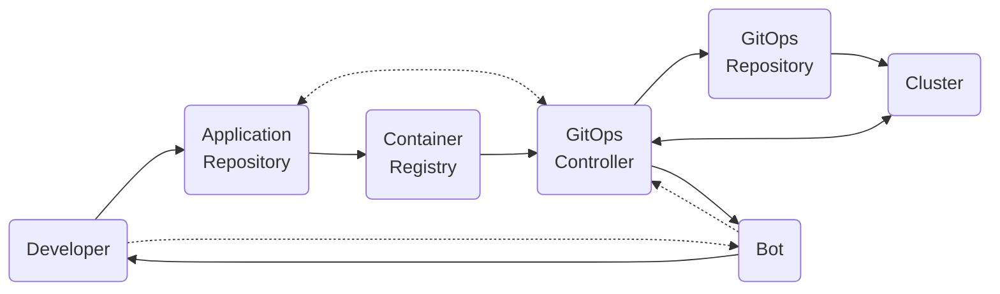
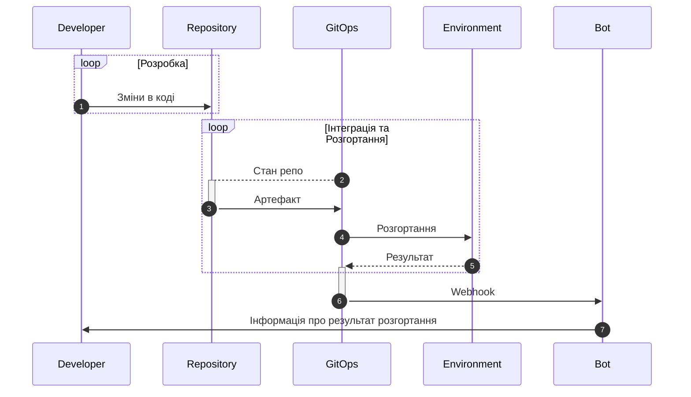
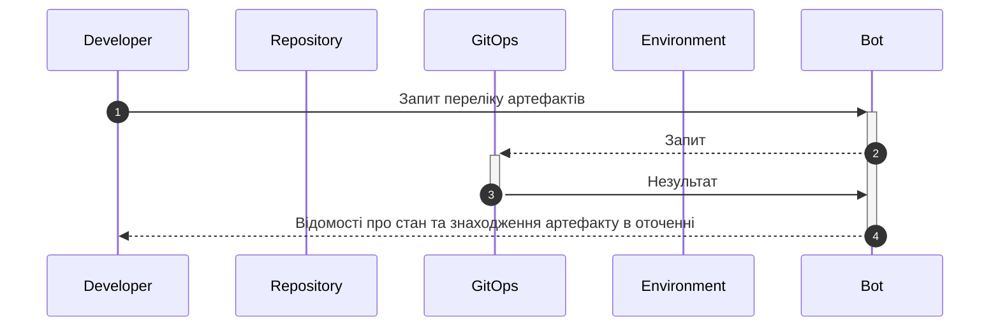
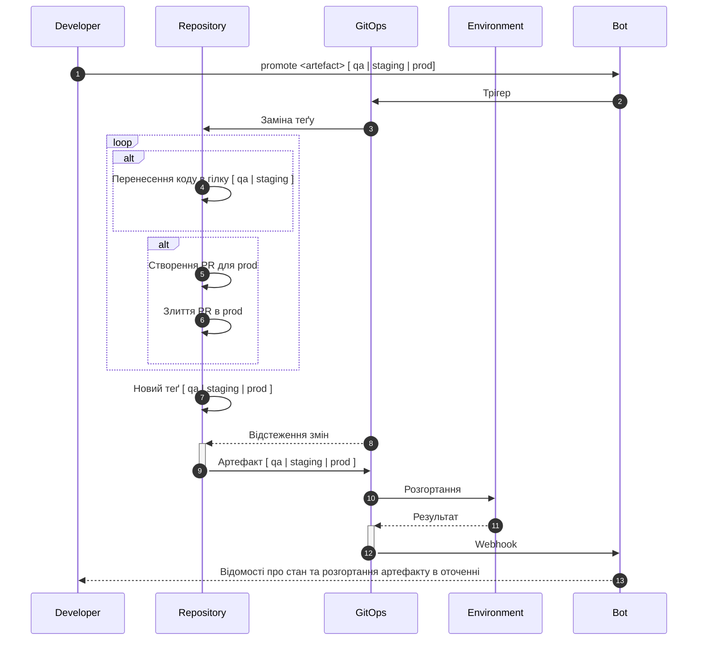
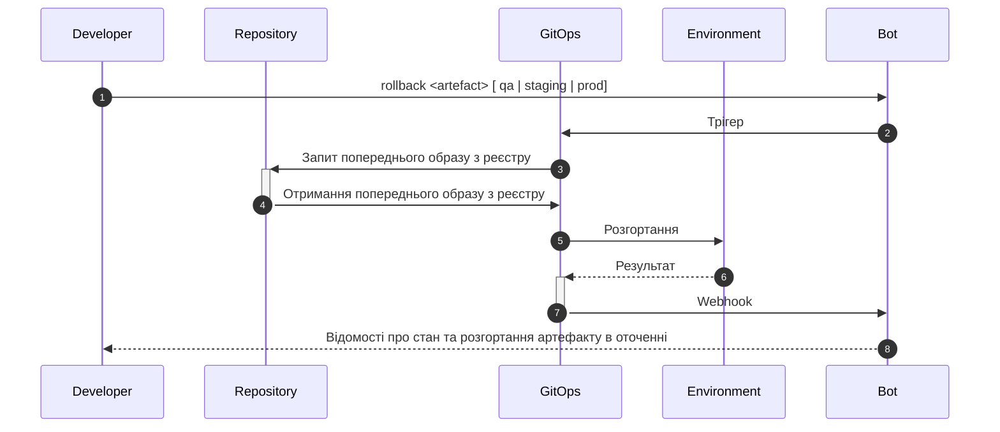
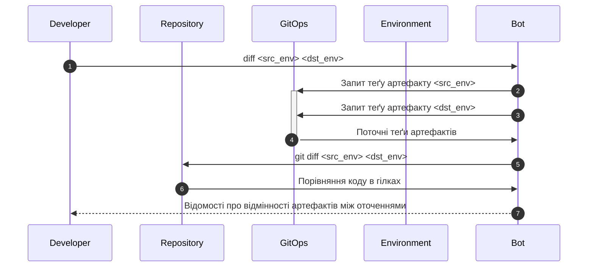

# High Level Design

Загальна архітектура системи, основні компоненти, взаємодія між ними та основні функціональні можливості.

## Функціонал

Система призначена для автоматизації розгортання та керування версіями артефактів відповідно до визначених правил.

- Зміни в коді розробки відбуваються в гілці `develop`. При внесенні змін в код, виконується автоматичне розгортання артефакту в оточенні `development`. Результат розгортання повертається розробнику ботом в Slack у визначеному для цього каналі.
- У разі успішного розгортання відповідного артефакту в оточенні `development`, розробник може вручну розгорнути артефакт в іншому оточенні за допомогою команди `promote`. Результат розгортання повертається розробнику ботом в Slack у визначеному для цього каналі. Передбачається розгортання артефакту в одному з наступних оточень: `qa`, `staging`, `prod`. При цьому, відбувається автоматичне розгортання артефакту в наступному за порядком оточенні. Результат розгортання повертається розробнику ботом в Slack.
- У разі неуспішного розгортання відповідного артефакту в оточенні, розробник може вручну відкотити артефакт в попередню версію за допомогою команди `rollback`. Результат розгортання повертається розробнику ботом в Slack. Передбачається відкат артефакту в одному з наступних оточень: `qa`, `staging`, `prod`. При цьому, відбувається автоматичне повернення до попереднього артефакту в зазначеному оточенні. Результат виконання відкату повертається розробнику ботом в Slack.
- При необхідності, розробник може отримати відомості про відмінності артефактів між оточеннями за допомогою команди `diff`. Результат розгортання повертається розробнику ботом в Slack.
- Перелік артефактів, які вже розгорнуті в різних оточеннях, можна отримати за допомогою команди `list`. Результат розгортання повертається розробнику ботом в Slack у визначеному для цього каналі.

## Архітектура

## Взаємодія з системою

### Розгортання змін в оточені development

- Розробник вносить зміни в код в гілці `develop`.
- GitOps контролер відстежує зміни в гілці `develop` та розгортає відповідний артефакт в оточенні `development`.
- Результат розгортання повертається розробнику ботом в Slack у визначеному для цього каналі.

### Команда list

Розробник отримує перелік артефактів, які вже розгорнуті в різних оточеннях.

### Команда promote

Розробник розгортає артефакт в іншому оточенні, відповідно до визначених правил. Результат розгортання повертається розробнику ботом в Slack.

Якщо розгортання відбувається в `qa` або `staging` оточенні, відбувається перенесення коду в гілку `qa` або `staging` відповідно. Якщо розгортання відбувається в `prod` оточенні, то відбувається створення PR для `prod` та злиття PR в `prod` після відповідної процедури затвердження змін.

Стандартно, якщо команда `promote` викликається без зазначення оточення, то розгортання артефакту відбувається в наступному за порядком оточенні. Якщо команда `promote` викликається з вказаним оточенням, то розгортання відбувається в зазначеному оточенні.

### Команда rollback

Команда `rollback` викликається з вказаним оточенням, відповідно до визначених правил. Результат розгортання повертається розробнику ботом в Slack. Виконання команди має призвести до відкату артефакту в попередню версію відповідно до визначених правил.

## Команда diff

Команда diff використовується для отримання відмінностей артефактів між оточеннями. Результат розгортання повертається розробнику ботом в Slack. Також надаються інструкції щодо дій потрібних для оновлення артефакту у відповідному оточенні.

