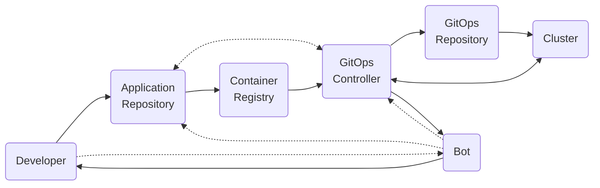
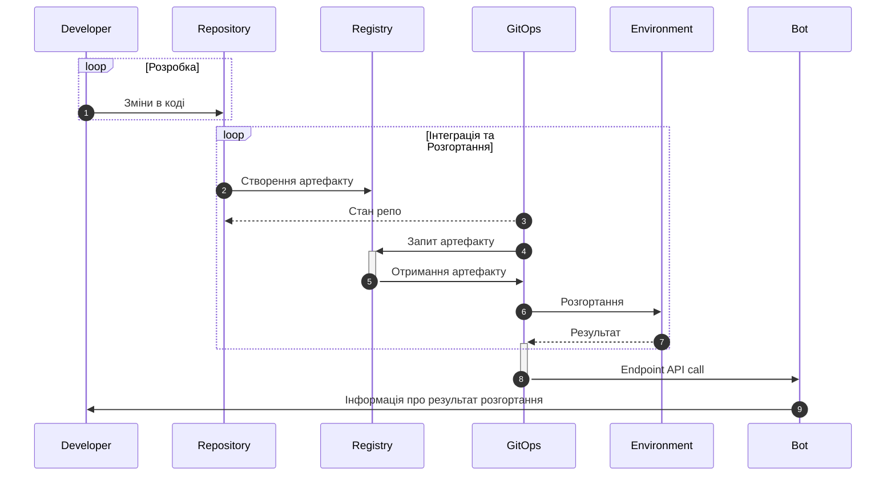
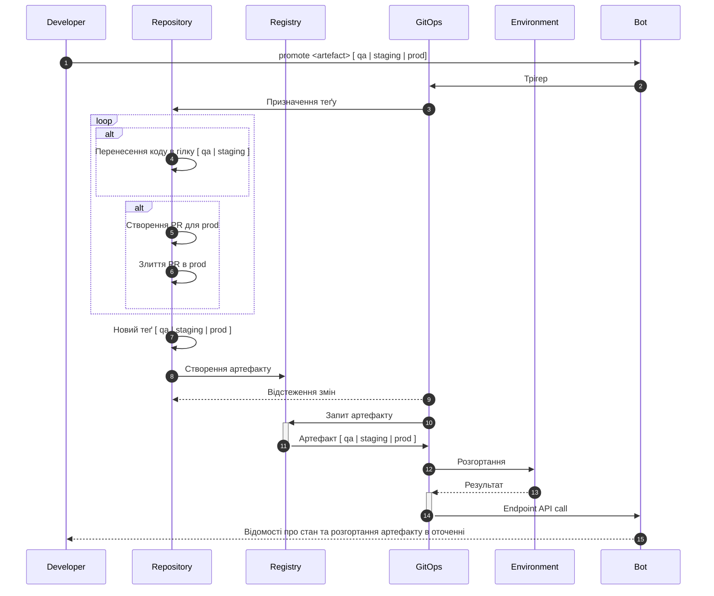
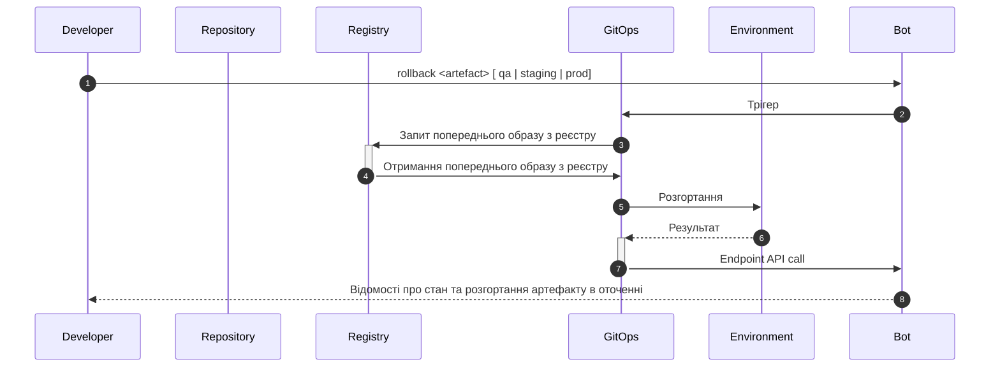
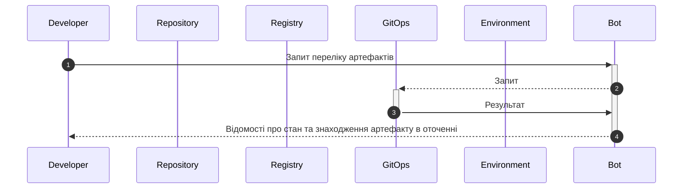
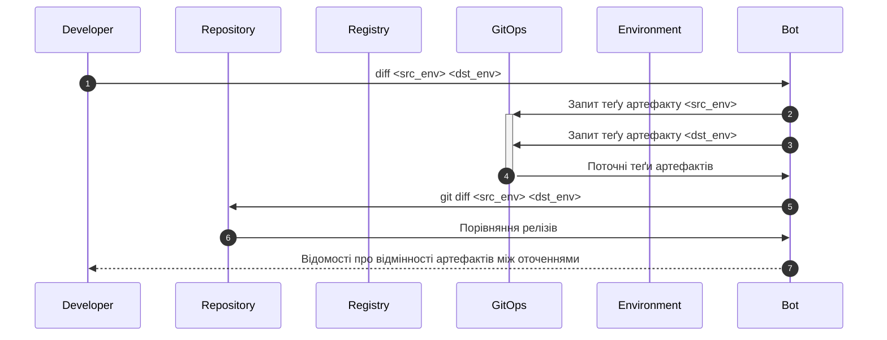

# High Level Design

Загальна архітектура системи, основні компоненти, взаємодія між ними та основні функціональні можливості.

## Функціонал

Система призначена для автоматизації розгортання та керування версіями артефактів відповідно до визначених правил.

- Зміни в коді розробки відбуваються в гілці `develop`. При внесенні змін в код, виконується автоматичне розгортання артефакту в оточенні `development`. Результат розгортання повертається розробнику ботом в Slack у визначеному для цього каналі.
- У разі успішного розгортання відповідного артефакту в оточенні `development`, розробник може вручну розгорнути артефакт в іншому оточенні за допомогою команди `promote`. Результат розгортання повертається розробнику ботом в Slack у визначеному для цього каналі. Передбачається розгортання артефакту в одному з наступних оточень: `qa`, `staging`, `prod`. При цьому, відбувається автоматичне розгортання артефакту в наступному за порядком оточенні. Результат розгортання повертається розробнику ботом в Slack.
- У разі неуспішного розгортання відповідного артефакту в оточенні, розробник може вручну відкотити артефакт в попередню версію за допомогою команди `rollback`. Результат розгортання повертається розробнику ботом в Slack. Передбачається відкат артефакту в одному з наступних оточень: `qa`, `staging`, `prod`. При цьому, відбувається автоматичне повернення до попереднього артефакту в зазначеному оточенні. Результат виконання відкату повертається розробнику ботом в Slack.
- При необхідності, розробник може отримати відомості про відмінності артефактів між оточеннями за допомогою команди `diff`. Результат розгортання повертається розробнику ботом в Slack.
- Перелік артефактів, які вже розгорнуті в різних оточеннях, можна отримати за допомогою команди `list`. Результат розгортання повертається розробнику ботом в Slack у визначеному для цього каналі.
- Одномоментно в одному оточені може знаходитись тільки один артефакт. При спробі розгортання артефакту в оточенні, в якому вже знаходиться інший артефакт, наявний артефакт буде замінений вказаним.
- За потреби кількість оточень може бути збільшена. При цьому, відповідні зміни вносяться в конфігурацію GitOps контролера.

## Архітектура



Архітектура системи передбачає наявність наступних компонентів:

- Репозиторій з кодом застосунку, розробка якого ведеться з дотриманням git-flow.
- Репозиторій з конфігурацією GitOps контролера.
- Реєстр образів контейнерів.
- 4 кластери Kubernetes: `development`, `qa`, `staging`, `prod`.

Розробник вносить зміни у гілку `develop` репозиторію застосунку. Створюється `dev` артефакт. GitOps контролер відстежує зміни в гілці `develop` та розгортає `dev` артефакт в оточенні (кластері) `development`. Результат розгортання повертається розробнику ботом в Slack.

Для проходження QA розробник дає боту команду `promote <dev-artifact> qa`. Бот запускає CI процедуру злиття коду з гілки `development` в гілку `qa` від зазначеного коміту (з якого було створено артефакт `dev`). Процедури CI створюють артефакт `qa`. GitOps контролер відстежує зміни в гілці `qa` та розгортає `qa` артефакт в оточенні (кластері) `qa`. Результат розгортання повертається розробнику ботом в Slack. Попередня версія артефакту зберігається в реєстрі образів. Так само відбувається і для оточення `staging`, якщо розробник дає команду `promote <qa-artifact> staging`. Розгортання на `prod` відбувається аналогічно, але створюється Pull Request для злиття коду з гілки `staging` в гілку `prod`. Після затвердження PR, відбувається злиття коду та створення артефакту `prod`. GitOps контролер відстежує зміни в гілці `prod` та розгортає `prod` артефакт в оточенні (кластері) `prod`. Результат розгортання повертається розробнику ботом в Slack.

В разі неуспішного розгортання чи за потреби повернутись до попередньої версії артефакту боту надсилається команда `rollback artefact`. Бот звертається через GitOps контролер до реєстру образів та отримує інформацію про попередню версію артефакту та виконує команду `promote <prev-artifact> <env>`.

Команда `list` дозволяє отримати перелік артефактів, які на поточний розгорнуті в різних оточеннях. Бот зчитує інформацію з БД та повертає результат.

Команда `diff` дозволяє отримати відмінності артефактів між оточеннями. Це дозволяє прийняти рішення про необхідність перенесення (розгортання) артефакту в іншому оточенні.

## Взаємодія з системою

### Розгортання змін в оточені development

- Розробник вносить зміни в код в гілці `develop`.
- GitOps контролер відстежує зміни в гілці `develop` та розгортає відповідний артефакт в оточенні `development`.
- Результат розгортання повертається розробнику ботом в Slack у визначеному для цього каналі.



### Команда promote

Застосування команди:

```sh
/promote <artefact> [ qa | staging | prod ]
```

Розробник розгортає артефакт в іншому оточенні, відповідно до визначених правил. Результат розгортання повертається розробнику ботом в Slack.

Якщо розгортання відбувається в `qa` або `staging` оточенні, відбувається перенесення коду в гілку `qa` або `staging` відповідно. Якщо розгортання відбувається в `prod` оточенні, то відбувається створення PR для `prod` та злиття PR в `prod` після відповідної процедури затвердження змін.

Стандартно, якщо команда `promote` викликається без зазначення оточення, то розгортання артефакту відбувається в наступному за порядком оточенні. Якщо команда `promote` викликається з вказаним оточенням, то розгортання відбувається в зазначеному оточенні.



### Команда rollback

Застосування команди:

```sh
/rollback <artefact> [ qa | staging | prod ]
```

Команда `rollback` викликається з вказаним оточенням, відповідно до визначених правил. Результат розгортання повертається розробнику ботом в Slack. Виконання команди має призвести до відкату артефакту в попередню версію відповідно до визначених правил.




### Команда list

Застосування команди:

```sh
/list 
```

Розробник отримує перелік артефактів, які вже розгорнуті в різних оточеннях.



## Команда diff

Застосування команди:

```sh
/diff <src_env> <dst_env>
```

Команда diff використовується для отримання відмінностей артефактів між оточеннями. Результат розгортання повертається розробнику ботом в Slack. Також надаються інструкції щодо дій потрібних для оновлення артефакту у відповідному оточенні.



---
 ← [Повернутись до змісту](../README.md)  
