# Створення застосунку в Slack та бота на мові GO

- Переходимо на Slack website
- Обираємо: `From Scratch`
- Вказуємо назву застосунку для Slackbot

    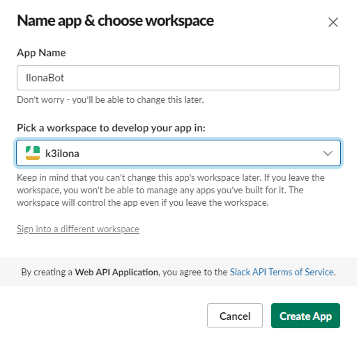  

- Натискаємо "Create App"

    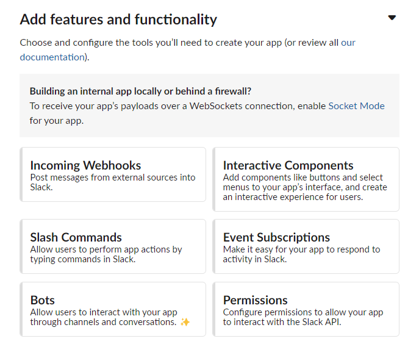

- Обираємо який саме застосунок нам потрібно створити: `Bots`.
- Потрапляємо на сторінку довідкової інформації де натискаємо `Review Scopes to Add`  
- Додамо чотири головних області застосування боту (scopes):

    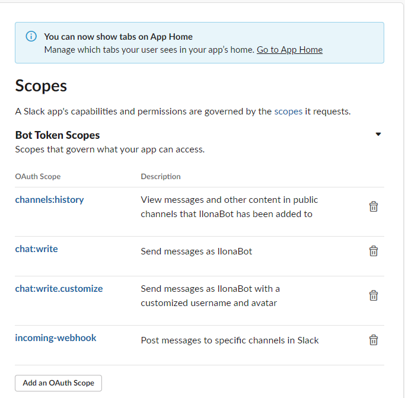

- Тепер можемо перейти до встановлення застосунку "Install the application"

    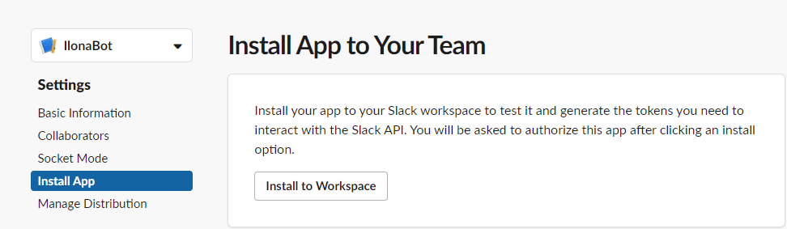

- Обираємо канал, який буде використовуватись ботом

    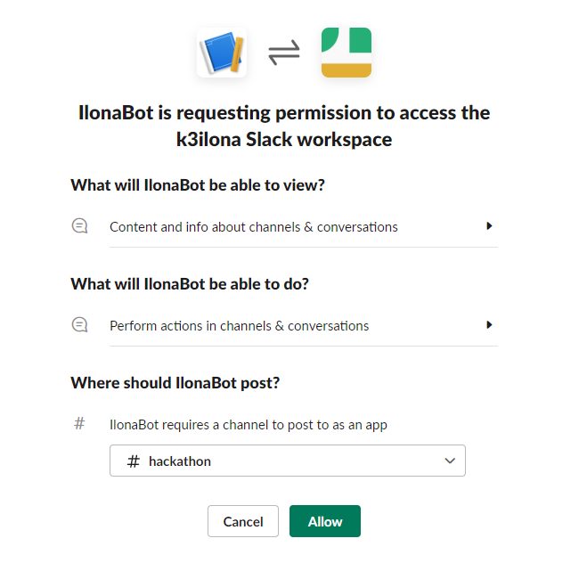

- Натискаємо `Allow` та отримуємо OAth Token та Webhook URL. 

    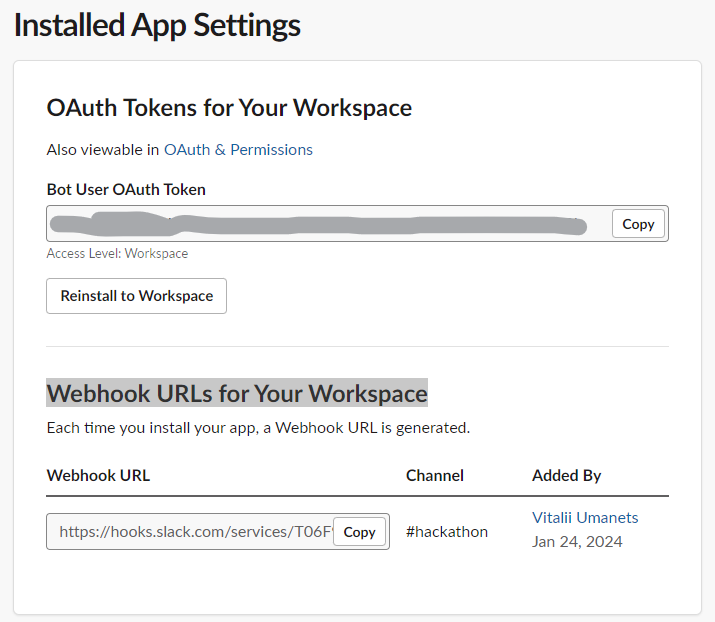

- Далі переходимо в створений WorkSpace Slack та запрошуємо бота на потрібний канал.

    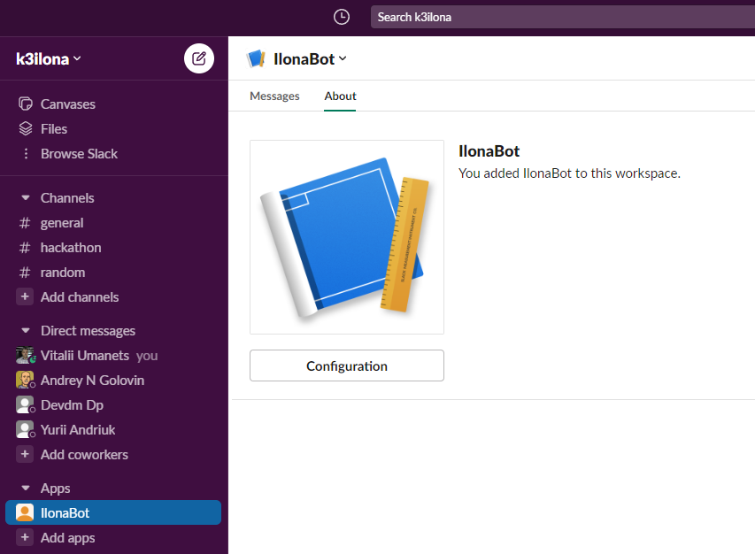

- Цю дію можна зробити наступною командою з використанням слеш `/`
  
    `/invite @IlonaBot`

## Golang Setup and Installation

```sh
✗ go mod init github.com/k3ilona/publisher-slack-bot
go: creating new go.mod: module github.com/k3ilona/publisher-slack-bot
go: to add module requirements and sums:
        go mod tidy

✗ cobra-cli init          
Your Cobra application is ready at
/root/publisher-slack-bot

✗ cobra-cli add ilonabot
✗ cobra-cli add list
✗ cobra-cli add diff
✗ cobra-cli add promote
✗ cobra-cli add rollback

✗ go get -u github.com/slack-go/slack

✗ go get -u github.com/joho/godotenv 

✗ go get -u golang.org/x/lint/golint
✗ export PATH=$PATH:$(go env GOPATH)/bin
✗ go install golang.org/x/lint/golint
```

You have to run the below command for the functioning of the program

```sh
✗ go get

✗ go run main.go

✗ gofmt -s -w ./                         

✗  go get github.com/slack-go/slack/socketmode

```
## Використання Slack Events API

API подій Slack — це спосіб обробки подій, які відбуваються в каналах Slack. Є багато подій, але для нашого бота ми хочемо слухати подію згадок. Це означає, що щоразу, коли хтось згадує бота, він отримуватиме подію для запуску. Події доставляються через WebSocket.

Ви можете знайти всі доступні типи подій у [документації](https://api.slack.com/web).

- Відвідаємо свою програму в [веб-інтерфейсі користувача](https://api.slack.com/apps). 
- Активуємо `Socket Mode`, це дозволить боту підключатися через WebSocket. 

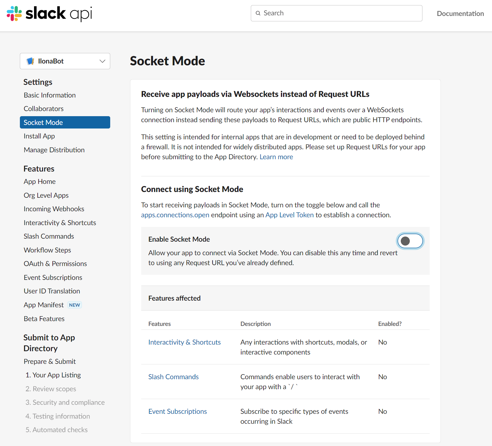  

- На цьому етапі буде згенерований `SLACK_APP_TOKEN`

- Активуємо підписки на події `Event Subscriptions`. Ви можете знайти його на вкладці `Features`  

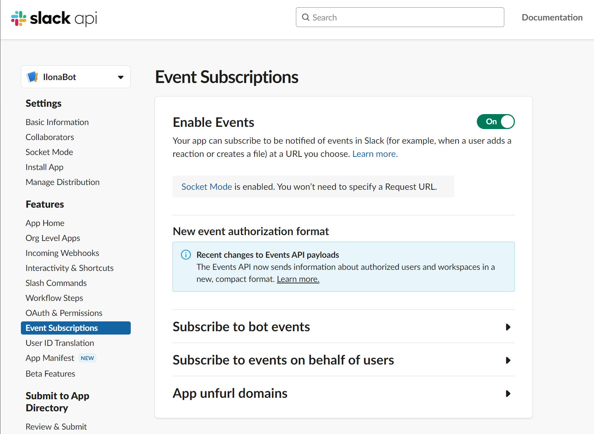  

- Потім додамо область `app_mentions` до `Event Subscriptions`. Це змусить згадки бота ініціювати нову подію для програми.

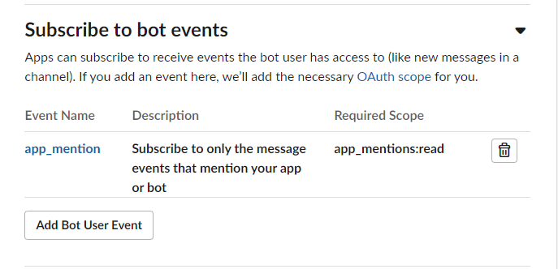 

- Перевірити наявність `SLACK_APP_TOKEN` можна за шляхом `Settings`->`Basic Information` скролити до низу, до розділу: `App-Level Tokens`. Якщо токена там не має, то слід нажати `Generate Tokens and Scope`.

- Збережемо всі secrets у файлі `.env`, захистив його попередньо від вивантаження у віддалений репозиторій. 
```sh
SLACK_AUTH_TOKEN=xoxb-**********************************************
SLACK_CHANNEL_ID=***********
SLACK_APP_TOKEN=xapp-***********************************************
```
- Запустимо бот `./ibot go` та перевіримо як він реагує на звернення з Slack
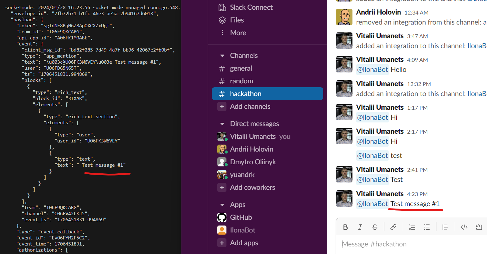

- Додамо в код `go func(ctx context.Context, client *slack.Client, socketClient *socketmode.Client)` 
- Запустимо бот командою `go run main.go go`, звернемось до боту через Slack та подивимось логи: 

```sh
    "type": "event_callback",
    "event_id": "Ev06FYJUNT35",
    "event_time": 1706453756,
    "authorizations": [
      {
        "enterprise_id": null,
        "team_id": "T06F9QKCABG",
        "user_id": "U06FK3W6VEY",
        "is_bot": true,
        "is_enterprise_install": false
      }
    ],
    "is_ext_shared_channel": false,
    "event_context": "4-eyJldCI6ImFwcF9tZW50aW9uIiwidGlkIjoiVDA2RjlRS0NBQkciLCJhaWQiOiJBMDZGSzFNMEFCRSIsImNpZCI6IkMwNkZWNDJMS0o1In0"
  },
  "type": "events_api",
  "accepts_response_payload": false,
  "retry_attempt": 0,
  "retry_reason": ""
```
- Подія, яку ми отримуємо, має тип `event_callback`, і ця подія містить `payload` (корисне навантаження) з фактично виконаною подією.

- Спочатку нам потрібно перевірити, чи це подія Callback, а потім чи це подія корисного навантаження `app_mention`.

- Реалізуємо `handleEventMessage`, який продовжить перемикання типів. Ми можемо використовувати поле `type`, щоб знати, як обробляти подію. Тоді ми можемо отримати подію корисного навантаження (payload event) за допомогою поля `InnerEvent`.

- Замінимо функцію вивода логів (або тимчасово додамо) у головній функції, яка друкувала подію, новою функцією handleEventMessage.

```go
// Now we have an Events API event, but this event type can in turn be many types, so we actually need another type switch
log.Println(eventsAPIEvent)

// Now we have an Events API event, but this event type can in turn be many types, so we actually need another type switch
err := handleEventMessage(eventsAPIEvent)
if err != nil {
	// Replace with actual err handeling
	log.Fatal(err)
}
- Тепер реєстрація події не робить бота веселим. Ми повинні змусити бота відповідати користувачеві, який його згадав, і якщо він сказав привіт, він також повинен привітати його.

- Для цього потрібно додати боту область застосування `users:read`

- Перезавантажимо бота та створимо функцію `handleAppMentionEvent`. Ця функція прийматиме `*slackevents.AppMentionEvent` та `slack.Client` як вхідні дані, щоб вона могла відповісти.

- Подія містить ідентифікатор користувача в `event.User`, тому ми можемо використовувати цей ідентифікатор для отримання інформації про користувача. 
- Канал для відповіді також доступний у `event.Channel`. 
- Останній фрагмент інформації, який нам потрібний, — це фактичне повідомлення, яке користувач надіслав, згадуючи, яке знаходиться в `event.Text`.

- Додамо в код модуля функцію `func handleAppMentionEvent(event *slackevents.AppMentionEvent, client *slack.Client)`

- Щоб почати використовувати цю функцію, нам також потрібно додати клієнта як вхідний параметр. Тому ми повинні оновити `handleEventMessage`, щоб прийняти його.

- Перезапустіть програму та спробуйте сказати «Привіт», а також сказати щось інше, щоб переконатися, що вона працює належним чином. Якщо ви отримуєте помилку «missing_scope», ви пропустили певний обсяг.

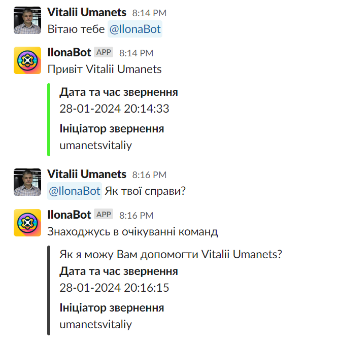

## Налаштування команд боту

- Додамо спеціальну команду /version в [веб-інтерфейс](https://api.slack.com/apps/A06FK1M0ABE/slash-commands). Коли ця команда спрацьовує, ми змусимо бота надіслати версію нашого застосунку.

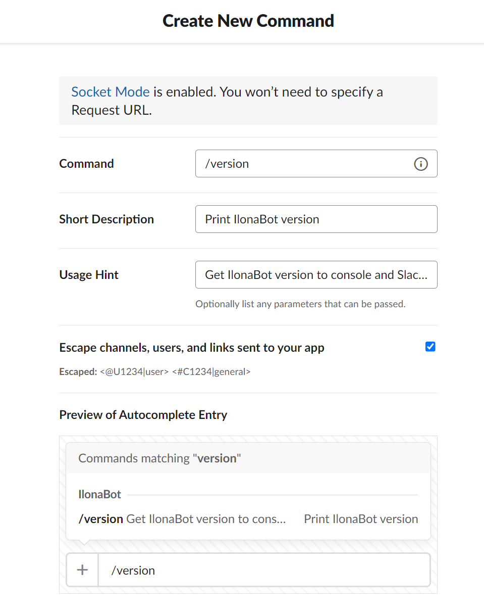

- Перевстановлюємо бота, та перевіряємо чи з'явилась команда:

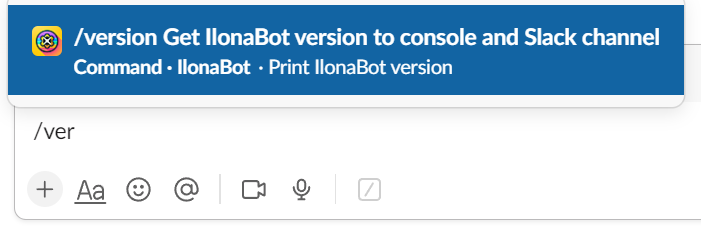

- Додамо код до EventsAPI, але цього разу ми додамо перемикач типу `EventTypeSlashCommand`

- Викликану команду ми знайдемо в `SlashCommand.Command`, а вхідний текст – у `SlashCommand.Text`. 

- Спочатку скеруємо команду на основі введення команди, а потім повернемо привітання в текстове поле. 

- Оновимо основний файл програми, щоб включити слухач для нового типу подій повідомлень у веб-сокеті.

- Додамо функцію маршрутизатора під назвою `handleSlashCommand`, яка просто перенаправлятиме до іншої функції. Наразі це може здатися надмірним, але якщо ви плануєте додати більше функцій, простіше створити кілька невеликих функцій. Особливо, якщо ви використовуєте модульні тести.

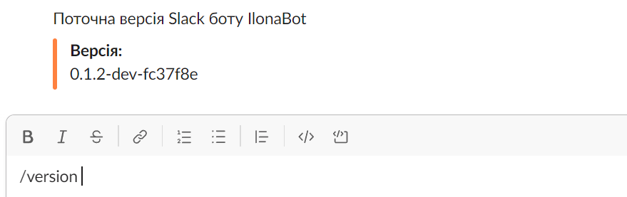


## Використані матеріали:
[How to Develop SlackBot Using Golang?](https://www.technource.com/blog/how-to-create-a-slackbot-using-golang/#What_Is_Slack_Bot)  
[Develop a Slack-bot using Golang](https://programmingpercy.tech/blog/develop-a-slack-bot-using-golang/)   
[GO Documentation](https://go.dev/doc/)   
[How to Distribute Go Modules](https://www.digitalocean.com/community/tutorials/how-to-distribute-go-modules)  

---
← [Повернутись до змісту](../README.md)  
